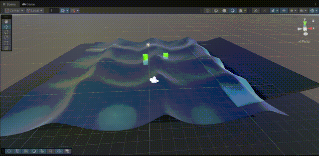

# 🌊 Stylized Water Shader for Unity

A professional, feature-rich water shader for Unity's Built-in Render Pipeline. This shader demonstrates advanced graphics programming techniques including tessellation, planar reflections, and physically-based wave simulation.



## ✨ Features

This shader includes **10 advanced rendering techniques**:

| Feature | Description |
|---------|-------------|
| **Depth-Based Coloring** | Realistic shallow-to-deep water color transition |
| **Gerstner Waves** | Physically accurate ocean wave simulation |
| **Normal Mapping** | Animated surface detail with dual-layer blending |
| **Fresnel Effect** | View-angle dependent reflectivity |
| **Planar Reflection** | Real-time mirror reflections on water surface |
| **Refraction** | Underwater distortion using GrabPass |
| **Subsurface Scattering** | Light transmission through wave peaks |
| **Caustics** | Animated underwater light patterns (Voronoi-based) |
| **Dynamic Foam** | Texture-based foam at edges and shorelines |
| **Tessellation** | Distance-based LOD for smooth wave geometry |

### Bonus Features
- Flow Maps support for directional water movement
- Shore Waves with animated foam
- Underwater Fog for depth-based visibility
- Specular Highlights (Blinn-Phong)

## 🛠️ Technical Details

### Shader Architecture
- **Vertex Shader**: Gerstner wave displacement with tangent/binormal calculation
- **Hull Shader**: Distance-based tessellation control
- **Domain Shader**: Vertex interpolation and wave application
- **Fragment Shader**: Multi-layer surface rendering

### Key Techniques
```hlsl
// Gerstner Wave Formula
float3 GerstnerWave(float4 wave, float3 p) {
    float k = 2 * PI / wavelength;
    float c = sqrt(9.8 / k);
    float f = k * (dot(direction, p.xz) - c * time);
    return float3(d.x * cos(f), sin(f), d.y * cos(f)) * amplitude;
}

// Distance-Based Tessellation
float CalcDistanceTessFactor(float4 vertex) {
    float dist = distance(worldPos, cameraPos);
    return lerp(maxTess, minTess, saturate(dist / maxDistance));
}
```

## 📋 Requirements

- Unity 2020.3+ (Tested on Unity 6)
- Built-in Render Pipeline
- DirectX 11+ or equivalent (for tessellation)
- Shader Model 4.6+

## 🚀 Installation

1. Clone this repository
```bash
git clone https://github.com/SametKaras/stylized-water-shader.git
```

2. Open the project in Unity

3. Open `Assets/Scenes/SampleScene.unity`

4. Attach `EnableDepthTexture.cs` to your Main Camera

5. For reflections, attach `PlanarReflection.cs` to your water plane

## ⚙️ Shader Parameters

### Water Colors
| Parameter | Description | Recommended |
|-----------|-------------|-------------|
| Shallow Color | Color in shallow areas | Light cyan |
| Deep Color | Color in deep areas | Dark blue |
| Depth Max Distance | Depth gradient range | 3-5 |

### Waves
| Parameter | Description | Recommended |
|-----------|-------------|-------------|
| Wave A/B/C | Direction(xy), Steepness(z), Wavelength(w) | Vary each |
| Wave Speed | Animation speed | 1-2 |

### Surface
| Parameter | Description | Recommended |
|-----------|-------------|-------------|
| Normal Map | Water surface detail texture | Seamless water normal |
| Normal Strength | Intensity of surface detail | 1-2 |
| Normal Scale | Tiling of normal map | 4-8 |

### Tessellation
| Parameter | Description | Recommended |
|-----------|-------------|-------------|
| Tessellation Factor | Max subdivision level | 8-16 |
| Min Distance | Full tessellation range | 5 |
| Max Distance | No tessellation range | 30 |

## 📁 Project Structure

```
Assets/
├── Shaders/
│   └── StylizedWater.shader    # Main water shader
├── Scripts/
│   ├── EnableDepthTexture.cs   # Camera depth setup
│   └── PlanarReflection.cs     # Real-time reflection camera
├── Materials/
│   └── WaterMaterial.mat       # Pre-configured material
└── Textures/
    ├── normal_opengl_4k.png    # Water normal map
    └── foam_diffuse.png        # Foam texture
```

## 📖 Technical Breakdown

Want to understand how each effect works? Check out the detailed technical breakdown:

**[📄 BREAKDOWN.md](BREAKDOWN.md)** — Mathematical foundations, code explanations, and implementation details for every technique.

Contents include:
- Gerstner Wave formulas and physical basis
- Voronoi-based caustics algorithm
- Tessellation pipeline (Hull/Domain shaders)
- Flow maps and dual-phase UV system
- Planar reflection camera mathematics
- And much more...

## 🎓 Learning Resources

This project demonstrates:
- GPU tessellation pipeline (Hull/Domain shaders)
- Screen-space effects (GrabPass, depth texture)
- Procedural pattern generation (Voronoi)
- Physically-based wave simulation
- Real-time planar reflection rendering

## 📄 License

MIT License - Feel free to use in your projects!

## 👤 Author

**Samet Karaş**
- GitHub: [@SametKaras](https://github.com/SametKaras)

---

⭐ If you found this useful, please consider giving it a star!
